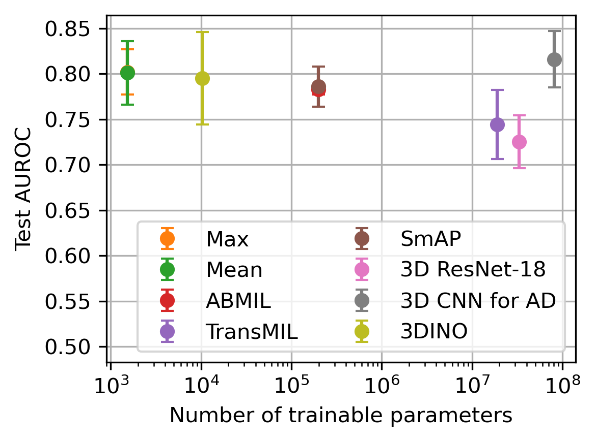

# neuroimage-classifiers
[A Multi-Dataset Benchmark of Multiple Instance Learning for 3D Neuroimage Classification](https://arxiv.org/abs/2502.01861) by Ethan Harvey\*, Dennis Johan Loevlie\*, Amir Ali Satani, Wansu Chen, David M. Kent, Michael C. Hughes


Figure 3: Figure 1: Test AUROC on OASIS-3 MRI (higher is better) vs. number of trainable parameters (lower is better) for MIL and 3D NN methods. **Takeaway: Mean pooling MIL is almost as good and far more efficient than the best MIL or 3D NN method.** All MIL methods use the same pre-trained ViT encoder.

## Installing environment
```
conda env create -f l3d_24f_cuda.yml
conda activate l3d_2024f_cuda12_1
```

## Citation
```bibtex
@inproceedings{harvey2026multi,
    author={Harvey, Ethan and Loevlie, Dennis Johan and Satani, Amir Ali and Chen, Wansu and Kent, David M. and Hughes, Michael C.},
    title={A Multi-Dataset Benchmark of Multiple Instance Learning for 3D Neuroimage Classification},
    booktitle={Conference on Health, Inference, and Learning (CHIL)},
    year={2026},
}
```
