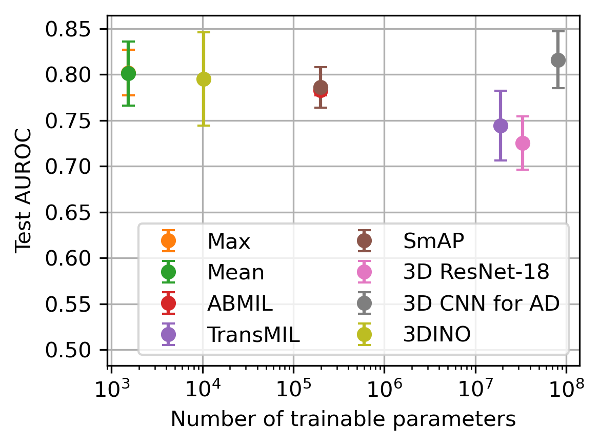

# neuroimage classifiers

Code to reproduce a 2026 research paper on methods for neural net-based classification of 3D brain images (MRI and CT).

> [A Multi-Dataset Benchmark of Multiple Instance Learning for 3D Neuroimage Classification](https://arxiv.org/abs/2604.26807) 
> <br /> Ethan Harvey\*, Dennis Johan Loevlie\*, Amir Ali Satani, Wansu Chen, David M. Kent, Michael C. Hughes
> <br /> Accepted, to appear at the <a href="https://chil.ahli.cc/">Conference on Health, Inference, and Learning (CHIL)</a>, 2026
> <br /> Full text available: [arXiv](https://arxiv.org/abs/2604.26807)

## Main figure



Figure 1: Test AUROC on OASIS-3 MRI (higher is better) vs. number of trainable parameters (lower is better) for MIL and 3D NN methods. **Takeaway: Mean pooling MIL is almost as good and far more efficient than the best MIL or 3D NN method.** All MIL methods use the same pre-trained ViT encoder.

## Installing environment
```
conda env create -f l3d_24f_cuda.yml
conda activate l3d_2024f_cuda12_1
```

## Citation
```bibtex
@inproceedings{harvey2026multi,
    author={Harvey, Ethan and Loevlie, Dennis Johan and Satani, Amir Ali and Chen, Wansu and Kent, David M. and Hughes, Michael C.},
    title={A Multi-Dataset Benchmark of Multiple Instance Learning for 3D Neuroimage Classification},
    booktitle={Conference on Health, Inference, and Learning (CHIL)},
    year={2026},
}
```
